# UML Diagrams — Sports Venue Booking Platform
> Complete system specification for Claude Code implementation
> Every functionality is defined here — nothing to be invented

---

## 1. Entity Relationship Diagram (ERD)

```mermaid
erDiagram
    cities {
        bigint id PK
        json name
        tinyint is_active
        int order_column
    }
    areas {
        bigint id PK
        bigint city_id FK
        json name
        tinyint is_active
        int order_column
    }
    users {
        bigint id PK
        varchar name
        varchar email
        varchar phone_number
        timestamp phone_verified_at
        varchar firebase_uid
        varchar password
        enum account_status
        bigint default_city_id FK
        bigint default_area_id FK
        text fcm_token
        enum fcm_platform
        tinyint notifications_push_enabled
        tinyint notifications_sms_enabled
        tinyint notifications_reminders_enabled
        enum preferred_language
        varchar google2fa_secret
        timestamp google2fa_enabled_at
        timestamp onboarding_completed_at
        timestamp last_login_at
        timestamp deleted_at
    }
    club_user {
        bigint id PK
        bigint club_id FK
        bigint user_id FK
    }
    social_identities {
        bigint id PK
        bigint user_id FK
        varchar provider
        varchar provider_uid
        varchar provider_email
        json provider_meta
    }
    otp_challenges {
        bigint id PK
        char uuid
        varchar phone_number
        varchar code_hash
        enum channel
        timestamp expires_at
        timestamp consumed_at
        tinyint attempts_count
        tinyint resend_count
        enum delivery_status
    }
    sport_categories {
        bigint id PK
        json name
        varchar slug
        int order_column
        tinyint is_active
    }
    clubs {
        bigint id PK
        bigint owner_id FK
        bigint area_id FK
        json name
        varchar slug
        json description
        varchar phone_number
        decimal latitude
        decimal longitude
        json amenities
        enum status
        tinyint is_featured
        decimal avg_rating
        int reviews_count
        int price_from
        timestamp approved_at
        timestamp deleted_at
    }
    venues {
        bigint id PK
        bigint club_id FK
        bigint sport_category_id FK
        json name
        json description
        varchar size
        json amenities
        json opening_hours
        decimal latitude
        decimal longitude
        decimal avg_rating
        int price_from
        enum status
        int order_column
        timestamp deleted_at
    }
    venue_pricing_tiers {
        bigint id PK
        bigint venue_id FK
        json name
        enum day_type
        enum specific_day
        time start_time
        time end_time
        smallint duration_minutes
        int price
        tinyint is_active
        int order_column
    }
    bookings {
        bigint id PK
        bigint user_id FK
        bigint venue_id FK
        bigint sport_category_id FK
        bigint recurrence_parent_id FK
        varchar booking_code
        enum source
        enum manual_type
        enum status
        date booking_date
        time start_time
        time end_time
        datetime starts_at
        datetime ends_at
        smallint duration_minutes
        int total_price
        timestamp cancelled_at
        bigint cancelled_by FK
        tinyint is_recurring
        json recurrence_pattern
        timestamp reminder_2h_sent_at
        timestamp reminder_1h_sent_at
        timestamp reviewed_at
    }
    slot_reservations {
        bigint id PK
        bigint venue_id FK
        bigint user_id FK
        bigint sport_category_id FK
        date booking_date
        time start_time
        time end_time
        smallint duration_minutes
        timestamp reserved_until
    }
    payment_methods {
        bigint id PK
        json name
        enum provider_key
        enum flow_type
        tinyint is_active
        int order_column
    }
    payments {
        bigint id PK
        bigint booking_id FK
        bigint user_id FK
        int amount
        enum provider
        enum flow_type
        enum status
        varchar provider_transaction_id
        varchar provider_reference
        json provider_meta
        json provider_payload
        timestamp initiated_at
        timestamp completed_at
        timestamp failed_at
    }
    wallets {
        bigint id PK
        bigint user_id FK
        int balance
        varchar currency
    }
    wallet_transactions {
        bigint id PK
        bigint wallet_id FK
        bigint created_by FK
        enum type
        int amount
        int balance_after
        enum reason
        varchar reference_type
        bigint reference_id
        text note
    }
    reviews {
        bigint id PK
        bigint user_id FK
        bigint club_id FK
        bigint booking_id FK
        decimal rating
        text body
        tinyint is_anonymous
        varchar venue_hint
        tinyint is_published
        timestamp hidden_at
    }
    saved_venues {
        bigint id PK
        bigint user_id FK
        bigint venue_id FK
    }
    app_platforms {
        bigint id PK
        varchar platform_key
        json name
        varchar latest_version
        varchar minimum_required_version
        varchar store_url
        varchar direct_apk_url
        tinyint is_active
    }
    app_environments {
        bigint id PK
        bigint platform_id FK
        varchar name
        varchar base_url
        tinyint is_active
    }
    content_pages {
        bigint id PK
        varchar slug
        json title
        json body
        tinyint is_active
    }
    competitions {
        bigint id PK
        json title
        json description
        date start_date
        date end_date
        tinyint is_published
    }
    venue_categories {
        bigint id PK
        json name
        varchar slug
        enum type
        tinyint is_active
        int order_column
    }
    commission_configs {
        bigint id PK
        enum scope
        bigint club_id FK
        bigint venue_id FK
        enum commission_type
        int commission_value
        enum apply_as
        int cancellation_fee
        tinyint is_active
        date effective_from
    }
    settlements {
        bigint id PK
        bigint club_id FK
        date period_from
        date period_to
        int total_bookings
        int total_venue_price
        int total_commission
        int net_payable
        int paid_amount
        enum status
        varchar payment_reference
        timestamp settled_at
    }
    settlement_items {
        bigint id PK
        bigint settlement_id FK
        bigint booking_id FK
        int venue_price
        int commission_amount
        int club_payout_amount
    }

    cities ||--o{ areas : "has"
    areas ||--o{ clubs : "contains"
    users ||--o{ club_user : "assigned_to"
    clubs ||--o{ club_user : "has_staff"
    users ||--o{ social_identities : "has"
    users ||--o{ bookings : "makes"
    users ||--o{ saved_venues : "saves"
    users ||--|| wallets : "has"
    wallets ||--o{ wallet_transactions : "has"
    clubs ||--o{ venues : "contains"
    clubs ||--o{ reviews : "receives"
    clubs ||--o{ settlements : "settled_by"
    venue_categories ||--o{ venues : "categorizes"
    commission_configs ||--o{ clubs : "scoped_to"
    commission_configs ||--o{ venues : "scoped_to"
    venues ||--o{ venue_pricing_tiers : "has"
    venues ||--o{ bookings : "receives"
    venues ||--o{ slot_reservations : "reserves"
    venues ||--o{ saved_venues : "saved_by"
    bookings ||--o{ payments : "paid_by"
    bookings ||--o{ reviews : "qualifies"
    bookings ||--o{ slot_reservations : "initiated_by"
    bookings ||--o{ settlement_items : "included_in"
    settlements ||--o{ settlement_items : "contains"
    app_platforms ||--o{ app_environments : "has"
```

---

## 2. Use Case Diagram — Mobile Player (اللاعب)

```mermaid
graph LR
    Player((اللاعب))

    subgraph AUTH["🔐 Authentication"]
        UC1[Request OTP via SMS]
        UC2[Request OTP via WhatsApp]
        UC3[Verify OTP]
        UC4[Sign in with Google]
        UC5[Link Google + Phone]
        UC6[Complete Profile]
        UC7[Add Phone Number]
        UC8[Logout]
    end

    subgraph DISCOVERY["🔍 Discovery"]
        UC9[Browse Home Feed]
        UC10[Search Clubs]
        UC11[Filter by Sport/Price/Rating]
        UC12[View Club Detail]
        UC13[View Grounds List]
        UC14[View Venue Detail]
        UC15[View Available Slots]
    end

    subgraph BOOKING["📅 Booking"]
        UC16[Reserve Slot - Soft Lock]
        UC17[Select Payment Method]
        UC18[Pay via MTN Cash OTP]
        UC19[Pay via Syriatel Cash OTP]
        UC20[Pay via Fatora WebView]
        UC21[Pay via SamaPay WebView]
        UC22[Pay via Wallet]
        UC23[Confirm Payment OTP]
        UC24[View Booking Confirmation]
        UC25[View Upcoming Bookings]
        UC26[Cancel Booking]
        UC27[View Booking History]
        UC28[Create Scheduled Booking]
    end

    subgraph PROFILE["👤 Profile"]
        UC29[View My Grounds - Recent+Saved]
        UC30[Save Venue]
        UC31[Unsave Venue]
        UC32[Write Review for Club]
        UC33[View Wallet Balance]
        UC34[View Wallet Transactions]
        UC35[Update Profile]
        UC36[Update Settings]
        UC37[Rate the App]
    end

    subgraph EVENTS["⚽ Events"]
        UC38[View Our Competitions]
        UC39[View Today's Matches]
        UC40[View Upcoming Matches]
        UC41[Pull to Refresh Matches]
    end

    subgraph CONTENT["📄 Content"]
        UC42[View Privacy Policy]
        UC43[View Terms of Service]
        UC44[View About Us]
        UC45[View Help]
    end

    Player --> UC1
    Player --> UC2
    Player --> UC3
    Player --> UC4
    Player --> UC5
    Player --> UC6
    Player --> UC7
    Player --> UC8
    Player --> UC9
    Player --> UC10
    Player --> UC11
    Player --> UC12
    Player --> UC13
    Player --> UC14
    Player --> UC15
    Player --> UC16
    Player --> UC17
    Player --> UC18
    Player --> UC19
    Player --> UC20
    Player --> UC21
    Player --> UC22
    Player --> UC23
    Player --> UC24
    Player --> UC25
    Player --> UC26
    Player --> UC27
    Player --> UC28
    Player --> UC29
    Player --> UC30
    Player --> UC31
    Player --> UC32
    Player --> UC33
    Player --> UC34
    Player --> UC35
    Player --> UC36
    Player --> UC37
    Player --> UC38
    Player --> UC39
    Player --> UC40
    Player --> UC41
    Player --> UC42
    Player --> UC43
    Player --> UC44
    Player --> UC45
```

---

## 3. Use Case Diagram — Club Dashboard

```mermaid
graph LR
    ClubAdmin((Club Admin))
    ClubOwner((Club Owner))
    DataEntry((Data Entry))

    subgraph CLUB_AUTH["🔐 Auth"]
        CA1[Login with Email+Password]
        CA2[Logout]
        CA3[Reset Password via SMS]
    end

    subgraph CLUB_MGMT["🏟️ Club Management"]
        CA4[View Club Profile]
        CA5[Edit Club Info]
        CA6[Manage Club Images]
        CA7[View Club Stats]
    end

    subgraph VENUE_MGMT["⚽ Venue Management"]
        CA8[List Venues]
        CA9[Create Venue]
        CA10[Edit Venue Info]
        CA11[Manage Venue Images]
        CA12[Set Opening Hours]
        CA13[Add Pricing Tier]
        CA14[Edit Pricing Tier]
        CA15[Delete Pricing Tier]
        CA16[Activate/Deactivate Venue]
    end

    subgraph BOOKING_MGMT["📅 Booking Management"]
        CA17[View Calendar]
        CA18[View Booking Details]
        CA19[Add Manual Booking - External]
        CA20[Add Blocked Period]
        CA21[Edit Manual Booking]
        CA22[Delete Manual Booking]
        CA23[Cancel Player Booking]
    end

    subgraph STAFF_MGMT["👥 Staff Management"]
        CA24[View Staff Members]
        CA25[Invite Staff Member]
        CA26[Remove Staff Member]
        CA27[Change Staff Role]
    end

    subgraph REPORTS["📊 Reports"]
        CA28[View Revenue Report]
        CA29[View Occupancy Report]
        CA30[Export Bookings - Excel]
        CA31[View Settlements History]
        CA32[View Pending Payout Balance]
        CA33[View Per-Booking Commission Deduction]
    end

    ClubAdmin --> CA1
    ClubAdmin --> CA2
    ClubAdmin --> CA3
    ClubAdmin --> CA4
    ClubAdmin --> CA5
    ClubAdmin --> CA6
    ClubAdmin --> CA7
    ClubAdmin --> CA8
    ClubAdmin --> CA9
    ClubAdmin --> CA10
    ClubAdmin --> CA11
    ClubAdmin --> CA12
    ClubAdmin --> CA13
    ClubAdmin --> CA14
    ClubAdmin --> CA15
    ClubAdmin --> CA16
    ClubAdmin --> CA17
    ClubAdmin --> CA18
    ClubAdmin --> CA19
    ClubAdmin --> CA20
    ClubAdmin --> CA21
    ClubAdmin --> CA22
    ClubAdmin --> CA23
    ClubAdmin --> CA24
    ClubAdmin --> CA25
    ClubAdmin --> CA26
    ClubAdmin --> CA27
    ClubAdmin --> CA28
    ClubAdmin --> CA29
    ClubAdmin --> CA30

    ClubOwner --> CA1
    ClubOwner --> CA2
    ClubOwner --> CA4
    ClubOwner --> CA7
    ClubOwner --> CA8
    ClubOwner --> CA17
    ClubOwner --> CA28
    ClubOwner --> CA29
    ClubOwner --> CA31
    ClubOwner --> CA32

    DataEntry --> CA1
    DataEntry --> CA2
    DataEntry --> CA8
    DataEntry --> CA9
    DataEntry --> CA10
    DataEntry --> CA11
    DataEntry --> CA12
    DataEntry --> CA13
    DataEntry --> CA14
    DataEntry --> CA15
    DataEntry --> CA17
    ClubAdmin --> CA31
    ClubAdmin --> CA32
    ClubAdmin --> CA33
    ClubAdmin --> CA34
    ClubOwner --> CA31
    ClubOwner --> CA32
    ClubOwner --> CA33
    ClubOwner --> CA34
    DataEntry --> CA19
    DataEntry --> CA20
```

---

## 4. Use Case Diagram — Super Admin Dashboard

```mermaid
graph LR
    SuperAdmin((Super Admin))

    subgraph ADMIN_AUTH["🔐 Auth"]
        AA1[Login Email+Password+2FA TOTP]
        AA2[Setup 2FA Google Authenticator]
        AA3[Logout]
    end

    subgraph USER_MGMT["👥 Users"]
        AA4[List All Users]
        AA5[View User Detail]
        AA6[Block User]
        AA7[Suspend User]
        AA8[Reactivate User]
        AA9[Create Club Staff Account]
        AA10[Assign Clubs to Staff]
        AA11[Remove Staff from Club]
    end

    subgraph CLUB_ADMIN["🏟️ Clubs"]
        AA12[View Pending Approval Queue]
        AA13[Approve Club]
        AA14[Reject Club with Reason]
        AA15[List All Clubs]
        AA16[Edit Any Club]
        AA17[Suspend Club]
        AA18[Feature/Unfeature Club]
        AA19[Create Club]
        AA20[Assign Owner to Club]
    end

    subgraph VENUE_ADMIN["⚽ Venues"]
        AA21[View All Venues]
        AA22[Edit Any Venue]
        AA23[Suspend Venue]
    end

    subgraph BOOKING_ADMIN["📅 Bookings"]
        AA24[View All Bookings]
        AA25[Filter Bookings]
        AA26[Cancel Any Booking]
        AA27[Override Booking Status]
        AA28[Export Bookings]
    end

    subgraph PAYMENT_ADMIN["💳 Payments"]
        AA29[View All Payments]
        AA30[Filter by Provider/Status]
        AA31[View Raw Provider Payload]
        AA32[Toggle Payment Method Active]
        AA33[Wallet Admin Adjustment]
    end

    subgraph COMMISSION["💰 Revenue & Settlements"]
        AA67[View Platform Revenue Dashboard]
        AA68[View Commission per Booking]
        AA69[View Cancellation Commissions]
        AA70[View Net Revenue by Period]
        AA71[Create Club Settlement]
        AA72[Mark Settlement as Paid]
        AA73[View All Settlements]
        AA74[Edit Commission Settings]
    end

    subgraph REVIEW_ADMIN["⭐ Reviews"]
        AA34[List All Reviews]
        AA35[Publish Review]
        AA36[Hide Review]
        AA37[View Reviewer + Booking]
    end

    subgraph CONTENT_ADMIN["📄 Content"]
        AA38[Edit Content Pages AR+EN]
        AA39[Manage Competitions]
        AA40[Publish Competition]
        AA41[Archive Competition]
    end

    subgraph CATEGORIES["🏅 Sport Categories"]
        AA42[Create Category]
        AA43[Edit Category]
        AA44[Reorder Categories]
        AA45[Activate/Deactivate]
        AA46[Upload Icon + Image]
    end

    subgraph GEO_MGMT["📍 Geography"]
        AA47[Manage Cities]
        AA48[Manage Areas]
        AA49[Reorder Areas]
    end

    subgraph APP_CONFIG["📱 App Config"]
        AA50[Manage App Platforms]
        AA51[Set Latest Version]
        AA52[Set Minimum Version]
        AA53[Set Store URL]
        AA54[Set Direct APK URL]
        AA55[Manage Environments]
        AA56[Switch Active Environment]
    end

    subgraph COMMISSION["💰 Commission & Revenue"]
        AA67[View Revenue Dashboard]
        AA68[Set Global Commission]
        AA69[Set Club Commission Override]
        AA70[Set Venue Commission Override]
        AA71[View Commission Report]
        AA72[Generate Club Settlement]
        AA73[Mark Settlement Paid]
        AA74[View All Settlements]
        AA75[View Platform Profit Report]
        AA76[Export Revenue Report]
    end

    subgraph CATEGORIES_V["🏷️ Venue Categories"]
        AA77[Create Venue Category]
        AA78[Edit Venue Category]
        AA79[Set Category Type sports/hall/etc]
        AA80[Reorder Categories]
        AA81[Activate/Deactivate Category]
    end

    subgraph SETTINGS["⚙️ Settings"]
        AA57[Edit OTP Settings]
        AA58[Edit Booking Settings]
        AA59[Toggle WhatsApp OTP]
        AA60[Switch Active SMS Provider]
        AA61[Edit Cancellation Policy]
        AA62[Edit Wallet Deduction Policy]
    end

    subgraph ROLES["🔑 Roles & Permissions"]
        AA63[Create Role]
        AA64[Edit Role Permissions]
        AA65[Assign Role to User]
        AA66[View All Permissions]
    end

    SuperAdmin --> AA1
    SuperAdmin --> AA2
    SuperAdmin --> AA3
    SuperAdmin --> AA4
    SuperAdmin --> AA5
    SuperAdmin --> AA6
    SuperAdmin --> AA7
    SuperAdmin --> AA8
    SuperAdmin --> AA9
    SuperAdmin --> AA10
    SuperAdmin --> AA11
    SuperAdmin --> AA12
    SuperAdmin --> AA13
    SuperAdmin --> AA14
    SuperAdmin --> AA15
    SuperAdmin --> AA16
    SuperAdmin --> AA17
    SuperAdmin --> AA18
    SuperAdmin --> AA19
    SuperAdmin --> AA20
    SuperAdmin --> AA21
    SuperAdmin --> AA22
    SuperAdmin --> AA23
    SuperAdmin --> AA24
    SuperAdmin --> AA25
    SuperAdmin --> AA26
    SuperAdmin --> AA27
    SuperAdmin --> AA28
    SuperAdmin --> AA29
    SuperAdmin --> AA30
    SuperAdmin --> AA31
    SuperAdmin --> AA32
    SuperAdmin --> AA33
    SuperAdmin --> AA34
    SuperAdmin --> AA35
    SuperAdmin --> AA36
    SuperAdmin --> AA37
    SuperAdmin --> AA38
    SuperAdmin --> AA39
    SuperAdmin --> AA40
    SuperAdmin --> AA41
    SuperAdmin --> AA42
    SuperAdmin --> AA43
    SuperAdmin --> AA44
    SuperAdmin --> AA45
    SuperAdmin --> AA46
    SuperAdmin --> AA47
    SuperAdmin --> AA48
    SuperAdmin --> AA49
    SuperAdmin --> AA50
    SuperAdmin --> AA51
    SuperAdmin --> AA52
    SuperAdmin --> AA53
    SuperAdmin --> AA54
    SuperAdmin --> AA55
    SuperAdmin --> AA56
    SuperAdmin --> AA57
    SuperAdmin --> AA58
    SuperAdmin --> AA59
    SuperAdmin --> AA60
    SuperAdmin --> AA61
    SuperAdmin --> AA62
    SuperAdmin --> AA63
    SuperAdmin --> AA64
    SuperAdmin --> AA65
    SuperAdmin --> AA66
    SuperAdmin --> AA67
    SuperAdmin --> AA68
    SuperAdmin --> AA69
    SuperAdmin --> AA70
    SuperAdmin --> AA71
    SuperAdmin --> AA72
    SuperAdmin --> AA73
    SuperAdmin --> AA74
    SuperAdmin --> AA75
    SuperAdmin --> AA76
    SuperAdmin --> AA77
    SuperAdmin --> AA78
    SuperAdmin --> AA79
    SuperAdmin --> AA80
    SuperAdmin --> AA81
    SuperAdmin --> AA67
    SuperAdmin --> AA68
    SuperAdmin --> AA69
    SuperAdmin --> AA70
    SuperAdmin --> AA71
    SuperAdmin --> AA72
    SuperAdmin --> AA73
    SuperAdmin --> AA74
```

---

## 5. Sequence Diagram — OTP Authentication Flow

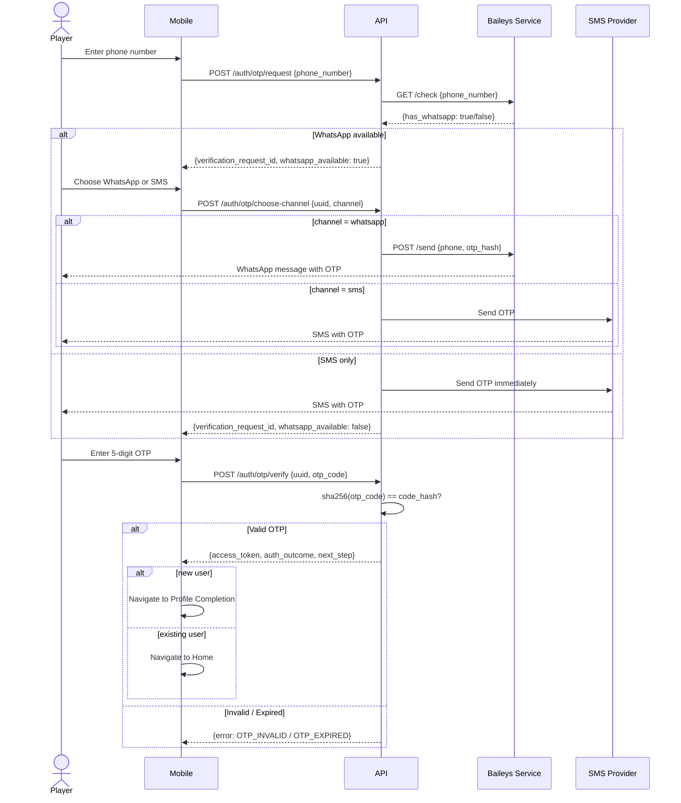

---

## 6. Sequence Diagram — Booking + Payment Flow (MTN Cash)

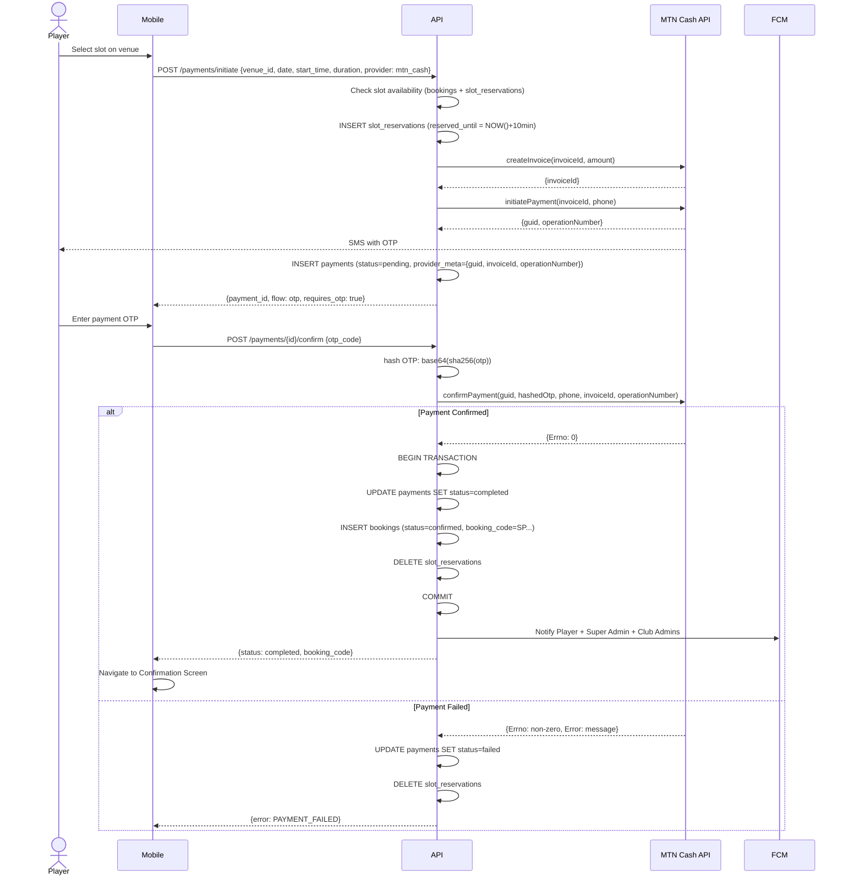

---

## 7. Sequence Diagram — Booking Cancellation + Vacancy Notification

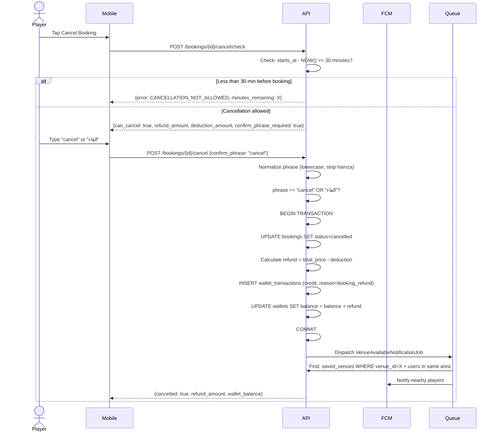

---

## 8. Sequence Diagram — Fatora/SamaPay WebView Payment

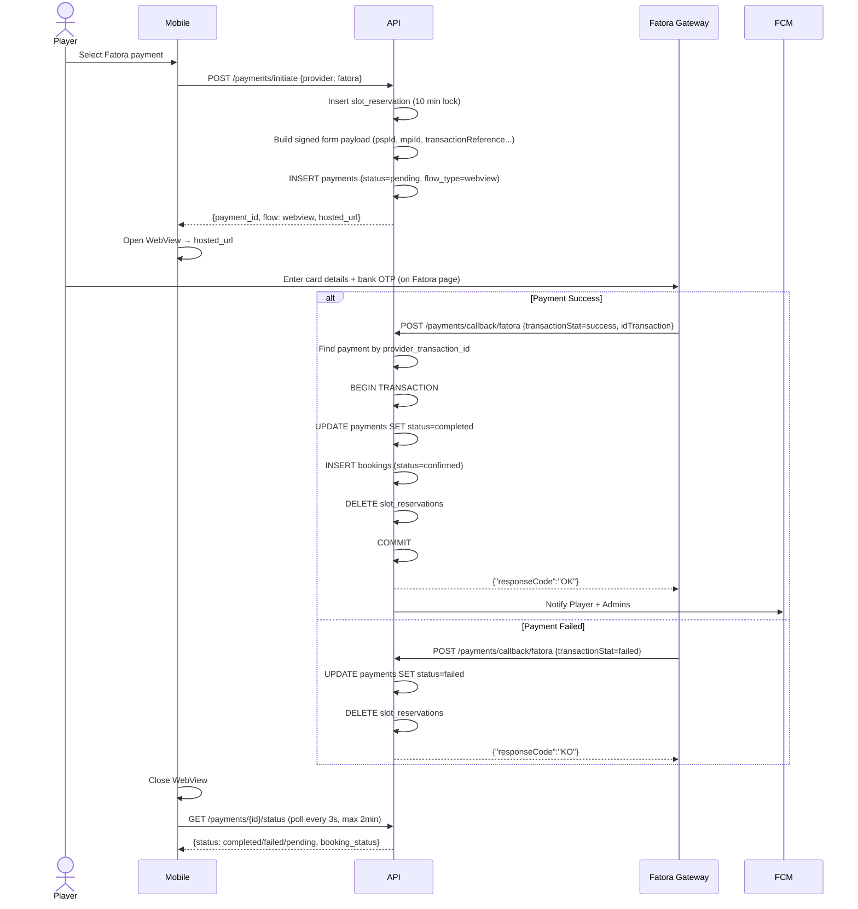

---

## 9. Sequence Diagram — Super Admin 2FA Login

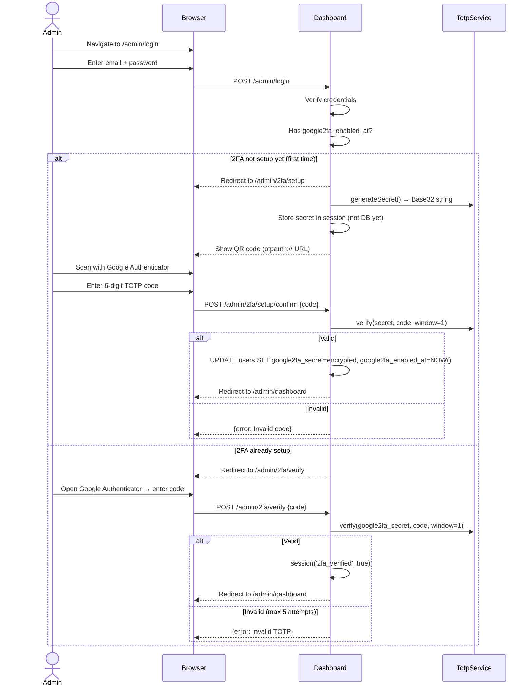

---

## 10. Class Diagram — Services Layer

```mermaid
classDiagram
    class OtpService {
        +generate(phone) OtpChallenge
        +verify(uuid, code) bool
        +resend(uuid) OtpChallenge
        -hashCode(code) string
        -isExpired(challenge) bool
        -isLocked(challenge) bool
    }

    class SmsOtpService {
        <<interface>>
        +send(phone, code) bool
    }

    class SyriatelOtpService {
        -url string
        -username string
        -password string
        -sender string
        +send(phone, code) bool
        -normalizePhone(phone) string
    }

    class MtnOtpService {
        -baseUrl string
        -terminalId string
        -privateKeyPath string
        +send(phone, code) bool
        -generateSignature(body) string
        -normalizePhone(phone) string
    }

    class WhatsAppOtpService {
        -serviceUrl string
        +checkAvailability(phone) bool
        +send(phone, code) bool
    }

    class TotpService {
        -STEP int
        -DIGITS int
        +generateSecret() string
        +verify(secret, code, window) bool
        +getQrCodeUrl(app, email, secret) string
        -generate(secret, timestamp) string
        -base32Encode(data) string
        -base32Decode(data) string
    }

    class FirebaseAuthService {
        -projectId string
        -jwksUrl string
        +verify(idToken) array
        -fetchPublicKeys() array
        -validateClaims(claims) bool
        +extractPhone(claims) string|null
    }

    class PaymentGateway {
        <<interface>>
        +initiate(booking, phone) PaymentResult
        +confirm(payment, otp) PaymentResult
        +handleCallback(payload) PaymentResult
        +resendOtp(payment) void
    }

    class MtnCashGateway {
        +initiate(booking, phone) PaymentResult
        +confirm(payment, otp) PaymentResult
        +resendOtp(payment) void
        -createInvoice(id, amount) array
        -initiatePayment(invoiceId, phone, seq) array
        -confirmPayment(guid, otp, phone, invoiceId, opNum) array
        -generateSignature(body) string
    }

    class SyriatelCashGateway {
        +initiate(booking, phone) PaymentResult
        +confirm(payment, otp) PaymentResult
        +resendOtp(payment) void
        -getToken() string
        -paymentRequest(msisdn, amount, txId) array
        -paymentConfirmation(otp, txId) array
    }

    class FatoraGateway {
        +initiate(booking, phone) PaymentResult
        +handleCallback(payload) PaymentResult
        -buildPayload(booking) array
        -verifyCallback(payload) bool
    }

    class SamaPayGateway {
        +initiate(booking, phone) PaymentResult
        +handleCallback(payload) PaymentResult
    }

    class WalletService {
        +credit(userId, amount, reason, referenceId) WalletTransaction
        +debit(userId, amount, reason, referenceId) WalletTransaction
        +getBalance(userId) int
        +canAfford(userId, amount) bool
        -lockWallet(walletId) void
    }

    class SlotService {
        +getAvailableSlots(venueId, date, duration) array
        +generateSlots(venue, date, duration) array
        +isSlotAvailable(venueId, date, startTime, duration) bool
        +resolveTierPrice(venueId, date, startTime, duration) int|null
        -getBookedSlots(venueId, date) array
        -getActiveReservations(venueId, date) array
    }

    class NotificationService {
        +notifyBookingConfirmed(booking) void
        +notifyBookingCancelled(booking) void
        +notifyVenueAvailable(venue, slot) void
        +notifyBookingReminder(booking, type) void
        +notifyScheduledPaymentDue(booking) void
        -sendFcm(token, title, body, data) void
        -findNearbyPlayers(venue) Collection
    }

    class CommissionService {
        +calculate(venuePrice, settings) CommissionResult
        +applyToBooking(booking, settings) void
        +calculateCancellationFee(booking, settings) int
    }

    class SettlementService {
        +calculateClubEarnings(clubId, from, to) int
        +createSettlement(clubId, from, to) ClubSettlement
        +markAsPaid(settlement, paidBy) void
        +getOutstandingBalance(clubId) int
    }

    class BookingService {
        +createFromPayment(payment, slotData) Booking
        +cancel(booking, cancelledBy) void
        +complete(booking) void
        +validateCancellationWindow(booking) bool
        +validateCancellationPhrase(phrase) bool
        -generateCode() string
    }

    SmsOtpService <|.. SyriatelOtpService
    SmsOtpService <|.. MtnOtpService
    SmsOtpService <|.. WhatsAppOtpService
    OtpService --> SmsOtpService
    PaymentGateway <|.. MtnCashGateway
    PaymentGateway <|.. SyriatelCashGateway
    PaymentGateway <|.. FatoraGateway
    PaymentGateway <|.. SamaPayGateway
    SamaPayGateway --|> FatoraGateway
    BookingService --> WalletService
    BookingService --> CommissionService
    BookingService --> NotificationService
    BookingService --> SlotService
```

---

## 11. State Machine — Booking Status

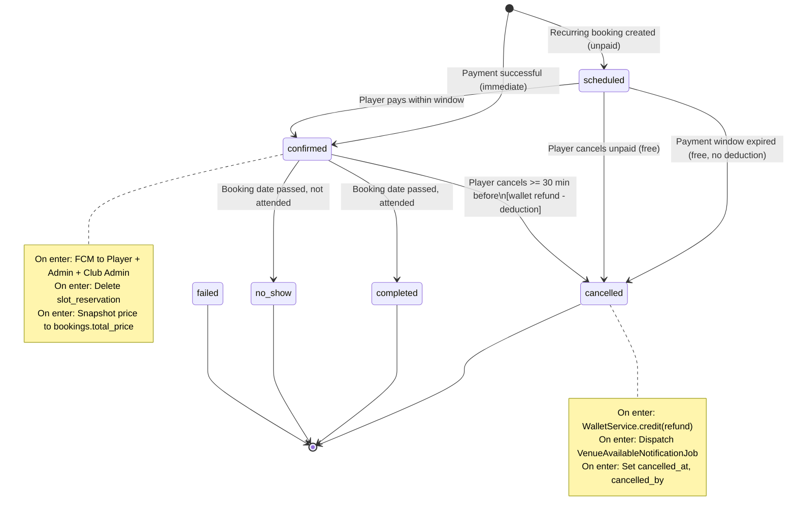

---

## 12. State Machine — Payment Status

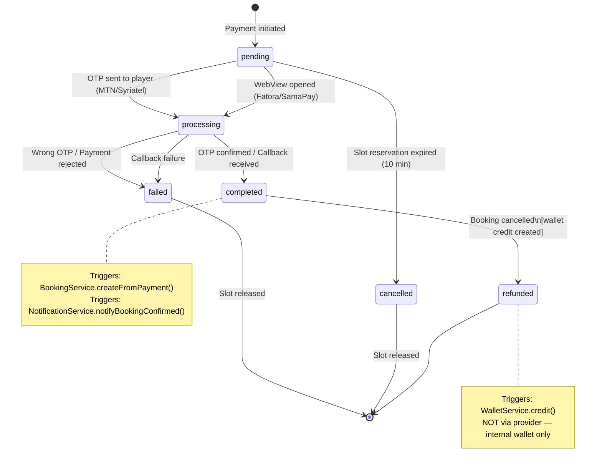

---

## 13. Component Diagram — System Architecture

```mermaid
graph TB
    subgraph Mobile["📱 Mobile App (Flutter)"]
        FlutterApp[Flutter App]
    end

    subgraph Web["🌐 Club Dashboard PWA"]
        ClubPWA[Vue 3 + Inertia PWA]
    end

    subgraph AdminWeb["🖥️ Admin Dashboard"]
        AdminPWA[Vue 3 + Inertia]
    end

    subgraph Laravel["⚙️ Laravel 13 Backend"]
        MobileAPI["/api/v1/* Mobile API"]
        AdminAPI["/api/admin/v1/* Admin API"]
        ClubAPI["/api/club/v1/* Club API"]
        InertiaAdmin["/admin/* Inertia Routes"]
        InertiaClub["/club/* Inertia Routes"]

        subgraph Services["Services"]
            OtpSvc[OtpService]
            TotpSvc[TotpService]
            FirebaseSvc[FirebaseAuthService]
            SlotSvc[SlotService]
            BookingSvc[BookingService]
            PayGW[PaymentGateway]
            WalletSvc[WalletService]
            NotifSvc[NotificationService]
        end

        subgraph Queue["Database Queue"]
            BookingNotif[BookingConfirmedJob]
            VacancyNotif[VenueAvailableJob]
            ReminderJob[BookingReminderJob]
            ScheduledPayJob[ScheduledPaymentDueJob]
        end

        subgraph Scheduler["Laravel Scheduler"]
            ExpireReservations[reservations:expire every 1min]
            SendReminders[reminders:send every 15min]
            ExpireScheduled[scheduled:expire daily]
            Backup[backup:run daily 2am]
        end
    end

    subgraph External["🌍 External Services"]
        SyriatelSMS[Syriatel OTP API]
        MtnSMS[MTN SMS API]
        BaileysNode[Baileys Node.js Service]
        MtnPay[MTN Cash API]
        SyriatelPay[Syriatel Cash API]
        FatoraGW[Fatora Gateway]
        SamaPayGW[SamaPay Gateway]
        GoogleFirebase[Firebase FCM HTTP v1]
        GoogleAuth[Google JWKS]
        FootballAPI[football-data.org]
    end

    subgraph DB["🗄️ MySQL Database"]
        MySQL[(MySQL 8.0)]
    end

    subgraph Storage["💾 Local Storage"]
        Files[storage/public]
    end

    FlutterApp <--> MobileAPI
    ClubPWA <--> InertiaClub
    ClubPWA <--> ClubAPI
    AdminPWA <--> InertiaAdmin
    AdminPWA <--> AdminAPI

    MobileAPI --> Services
    AdminAPI --> Services
    ClubAPI --> Services
    InertiaAdmin --> Services
    InertiaClub --> Services

    Services --> Queue
    Scheduler --> Queue
    Scheduler --> MySQL

    OtpSvc --> SyriatelSMS
    OtpSvc --> MtnSMS
    OtpSvc --> BaileysNode
    BaileysNode --> External

    TotpSvc --> TotpSvc

    FirebaseSvc --> GoogleAuth

    PayGW --> MtnPay
    PayGW --> SyriatelPay
    PayGW --> FatoraGW
    PayGW --> SamaPayGW

    NotifSvc --> GoogleFirebase

    Services --> MySQL
    Services --> Files

    Queue --> GoogleFirebase
    Queue --> MySQL
```

---

## 14. API Routes Summary

```mermaid
graph LR
    subgraph PUBLIC["🌐 Public"]
        R1["POST /api/v1/app/startup"]
        R2["POST /api/v1/auth/otp/request"]
        R3["POST /api/v1/auth/otp/choose-channel"]
        R4["POST /api/v1/auth/otp/verify"]
        R5["POST /api/v1/auth/otp/resend"]
        R6["POST /api/v1/auth/google"]
        R7["GET /api/v1/categories"]
        R8["GET /api/v1/cities"]
        R9["GET /api/v1/cities/{id}/areas"]
        R10["GET /api/v1/clubs"]
        R11["GET /api/v1/clubs/price-range"]
        R12["GET /api/v1/clubs/{id}"]
        R13["GET /api/v1/clubs/{id}/venues"]
        R14["GET /api/v1/clubs/{id}/venues/{vid}"]
        R15["GET /api/v1/clubs/{id}/venues/{vid}/slots"]
        R16["GET /api/v1/content-pages/{slug}"]
        R17["GET /api/v1/payment-methods"]
        R18["GET /api/v1/events/competitions"]
        R19["GET /api/v1/events/matches/today"]
        R20["GET /api/v1/events/matches/upcoming"]
        R21["POST /api/v1/payments/callback/fatora"]
        R22["POST /api/v1/payments/callback/sama_pay"]
    end

    subgraph AUTH["🔒 Authenticated (Player)"]
        R23["GET /api/v1/me"]
        R24["PUT /api/v1/me"]
        R25["GET /api/v1/me/settings"]
        R26["PUT /api/v1/me/settings"]
        R27["POST /api/v1/me/phone/request"]
        R28["POST /api/v1/me/phone/verify"]
        R29["POST /api/v1/auth/logout"]
        R30["GET /api/v1/bookings"]
        R31["POST /api/v1/payments/initiate"]
        R32["POST /api/v1/payments/{id}/confirm"]
        R33["POST /api/v1/payments/{id}/resend-otp"]
        R34["GET /api/v1/payments/{id}/status"]
        R35["POST /api/v1/bookings/{id}/cancel/check"]
        R36["POST /api/v1/bookings/{id}/cancel"]
        R37["GET /api/v1/me/grounds"]
        R38["POST /api/v1/saved-venues"]
        R39["DELETE /api/v1/saved-venues/{venue_id}"]
        R40["GET /api/v1/me/wallet"]
        R41["GET /api/v1/me/wallet/transactions"]
        R42["POST /api/v1/clubs/{id}/reviews"]
        R43["GET /api/v1/clubs/{id}/reviews"]
    end
```


---

## 15. Sequence Diagram — Commission Calculation at Booking

```mermaid
sequenceDiagram
    participant Mobile
    participant API
    participant CommissionSvc as CommissionService
    participant DB

    Mobile->>API: POST /payments/initiate {venue_id, date, start_time, duration}
    API->>DB: Get venue + pricing tier → venue_price = 350,000 SYP
    API->>CommissionSvc: resolveConfig(venue_id)
    CommissionSvc->>DB: Check venue-level commission config
    CommissionSvc->>DB: Check club-level commission config
    CommissionSvc->>DB: Get global commission config
    CommissionSvc-->>API: {type: fixed, value: 5000, apply_as: added, cancellation_fee: 25000}

    API->>CommissionSvc: calculate(350000, config)
    CommissionSvc-->>API: CommissionResult {
        venue_price: 350000,
        commission_amount: 5000,
        apply_as: added,
        total_price: 355000,
        club_payout_amount: 350000,
        cancellation_commission: 25000
    }

    API->>DB: INSERT slot_reservations
    API->>DB: INSERT payments {amount: 355000, status: pending}
    API-->>Mobile: {payment_id, amount: 355000, display_price: "355,000 SYP"}

    Note over API,DB: On Payment Success:
    API->>DB: BEGIN TRANSACTION
    API->>DB: INSERT bookings {
        venue_price: 350000,
        commission_amount: 5000,
        commission_type: fixed,
        apply_as: added,
        total_price: 355000,
        club_payout_amount: 350000,
        cancellation_commission: 25000
    }
    API->>DB: UPDATE payments SET status=completed
    API->>DB: DELETE slot_reservations
    API->>DB: COMMIT
```

---

## 16. Sequence Diagram — Club Settlement

```mermaid
sequenceDiagram
    actor Admin as Super Admin
    participant Dashboard
    participant API
    participant DB

    Admin->>Dashboard: Navigate to Settlements → Club X
    Dashboard->>API: GET /admin/clubs/{id}/settlements/preview?from=2025-01-01&to=2025-01-31
    API->>DB: SELECT bookings WHERE venue.club_id=X AND status IN (confirmed,completed)
              AND booking_date BETWEEN dates AND booking_id NOT IN (SELECT booking_id FROM settlement_items)
    DB-->>API: 47 unsettled bookings
    API->>API: SUM(venue_price)=16,450,000 SUM(commission)=235,000 SUM(payout)=16,215,000
    API-->>Dashboard: {bookings: 47, total_venue: 16450000, total_commission: 235000, net_payable: 16215000}

    Admin->>Dashboard: Click "Generate Settlement"
    Dashboard->>API: POST /admin/settlements {club_id, period_from, period_to}
    API->>DB: BEGIN TRANSACTION
    API->>DB: INSERT settlements {status: draft, net_payable: 16215000}
    API->>DB: INSERT settlement_items (one per booking)
    API->>DB: COMMIT
    API-->>Dashboard: {settlement_id, status: draft}

    Admin->>Dashboard: Review + confirm → "Mark as Pending"
    Admin->>Dashboard: Transfer money to club offline
    Admin->>Dashboard: Enter payment_reference → "Mark as Completed"
    Dashboard->>API: PATCH /admin/settlements/{id} {status: completed, payment_reference: "TRX-12345", paid_amount: 16215000}
    API->>DB: UPDATE settlements SET status=completed, settled_at=NOW(), settled_by=admin_id
    API-->>Dashboard: {settled: true}

    Note over Dashboard: Club Dashboard now shows this settlement as "مدفوع"
```
